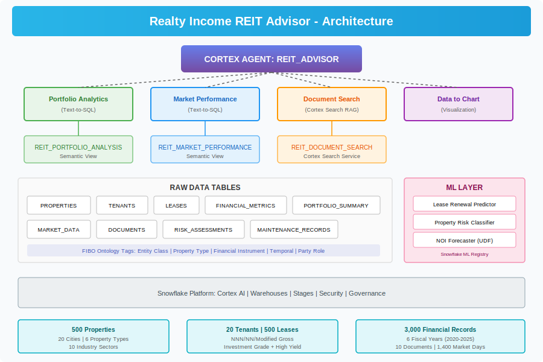

# Realty Income REIT Investment Advisor Agent

A comprehensive Snowflake Cortex Agent implementation for Realty Income Corporation (NYSE: O) portfolio analytics, financial insights, risk assessment, and document-based Q&A.



## Project Overview

This project demonstrates an end-to-end AI agent deployment on Snowflake, combining:
- **Cortex Agent** for natural language interaction
- **Semantic Views** for structured data querying via Cortex Analyst
- **Cortex Search** for document RAG (Retrieval-Augmented Generation)
- **ML Models** for predictive analytics (lease renewal, risk scoring)
- **FIBO Ontology** for financial industry standards alignment

## Architecture

```
┌─────────────────────────────────────────────────────────┐
│                   CORTEX AGENT                           │
│               REIT_ADVISOR (Agent)                       │
├──────────┬──────────────────┬──────────────┬────────────┤
│ Portfolio│  Market Perf.    │  Document    │  Chart     │
│ Analytics│  (Semantic View) │  Search      │  Tool      │
│ (SV)     │                  │  (RAG)       │            │
├──────────┴──────────────────┴──────────────┴────────────┤
│              SEMANTIC VIEWS                               │
│  REIT_PORTFOLIO_ANALYSIS  │  REIT_MARKET_PERFORMANCE    │
├───────────────────────────┴─────────────────────────────┤
│              RAW DATA TABLES                              │
│  Properties │ Tenants │ Leases │ Financial Metrics       │
│  Portfolio Summary │ Market Data │ Documents │ Risk      │
├─────────────────────────────────────────────────────────┤
│              ML MODELS & FUNCTIONS                        │
│  Lease Renewal Predictor │ Property Risk Classifier      │
│  NOI Forecaster │ Property Scorer                        │
└─────────────────────────────────────────────────────────┘
```

## Quick Start

Execute the SQL scripts in order:

```bash
# 1. Create database and schemas
sql/setup/01_database_and_schema.sql

# 2. Create tables
sql/setup/02_create_tables.sql

# 3. Apply FIBO ontology tags
sql/setup/03_Financial_Industry_Business_Ontology.sql

# 4. Generate synthetic data
sql/data/04_generate_synthetic_data.sql

# 5. Create analytics views
sql/views/05_create_views.sql

# 6. Create semantic views
sql/views/06_create_semantic_views.sql

# 7. Create Cortex Search service
sql/search/07_create_cortex_search.sql

# 8. Train ML models (run notebook)
notebooks/08_ml_models.ipynb

# 9. Create ML model SQL functions
sql/models/09_ml_model_functions.sql

# 10. Create the Cortex Agent
sql/agent/10_create_agent.sql
```

## Project Structure

```
├── README.md
├── docs/
│   ├── AGENT_SETUP.md          # Detailed setup instructions
│   ├── DEPLOYMENT_SUMMARY.md   # Deployment architecture overview
│   ├── questions.md            # 30+ test questions for the agent
│   └── images/
│       ├── architecture.svg
│       ├── deployment_flow.svg
│       └── ml_models.svg
├── sql/
│   ├── setup/
│   │   ├── 01_database_and_schema.sql
│   │   ├── 02_create_tables.sql
│   │   └── 03_Financial_Industry_Business_Ontology.sql
│   ├── data/
│   │   └── 04_generate_synthetic_data.sql
│   ├── views/
│   │   ├── 05_create_views.sql
│   │   └── 06_create_semantic_views.sql
│   ├── search/
│   │   └── 07_create_cortex_search.sql
│   ├── models/
│   │   └── 09_ml_model_functions.sql
│   └── agent/
│       └── 10_create_agent.sql
└── notebooks/
    └── 08_ml_models.ipynb
```

## Key Features

| Feature | Description |
|---------|-------------|
| **Natural Language Querying** | Ask questions about the portfolio in plain English |
| **Multi-Tool Routing** | Agent intelligently routes to structured data, documents, or charts |
| **Semantic Views** | Business-friendly data model with metrics, dimensions, and relationships |
| **Document RAG** | Search earnings calls, SEC filings, and knowledge base |
| **ML Predictions** | Lease renewal probability and property risk classification |
| **FIBO Compliance** | Financial Industry Business Ontology tags for interoperability |
| **Visualization** | Automatic chart generation from data queries |

## Data Model

- **500 Properties** across 20 US cities with realistic REIT characteristics
- **20 Tenants** based on actual Realty Income tenant profiles
- **500 Leases** with NNN/NN/Modified Gross structures
- **3,000 Financial Metrics** covering 6 fiscal years (2020-2025)
- **22 Portfolio Summaries** with quarterly KPIs
- **1,400 Market Data** daily trading records
- **10 Documents** including earnings calls, SEC filings, and research
- **1,000 Risk Assessments** with multi-factor scoring
- **800 Maintenance Records** for property upkeep tracking

## Requirements

- Snowflake account with Cortex AI enabled
- ACCOUNTADMIN role (for initial setup)
- Warehouse: MEDIUM or larger recommended
- Cortex cross-region enabled: `ALTER ACCOUNT SET CORTEX_ENABLED_CROSS_REGION = 'ANY_REGION'`
